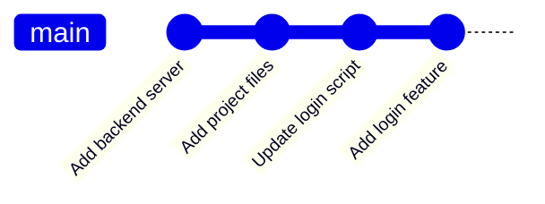

<p align="center">
  
</p>

<p align="center">
  
  
  
  
</p>

## 🧠 What This Is

A deliberately minimal two-tier app (Express backend + HTML/CSS/JS frontend) created for **DevOps Assignment 3**. The point is the **version-control workflow**, not the app: initialising a repo, structuring frontend/backend folders, ignoring `node_modules`, and building a feature through small, descriptive commits.



**My role:** individual assignment.

> ➡️ The full deployment version of this app — with an automated **AWS CodePipeline → CodeBuild → CodeDeploy** pipeline to EC2 and S3 — lives in **[PulseFit-DevOps](https://github.com/ahmadmuzii/PulseFit-DevOps)**.

## 🚀 Run

```bash
cd backend && npm install && node server.js   # → http://localhost:3000
```

Then open `frontend/index.html` in a browser.
